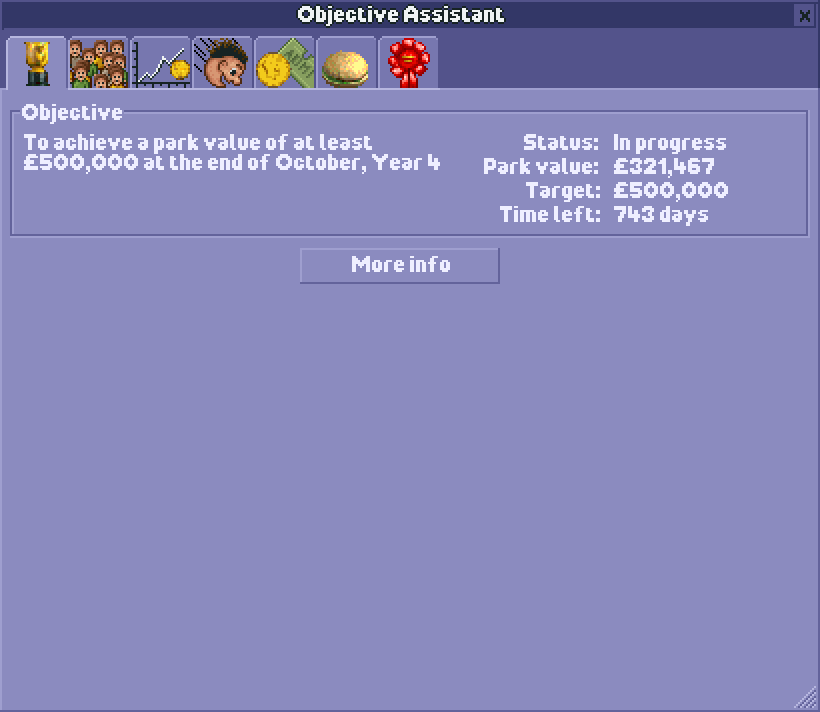

# An OpenRCT2 plugin to help achieve your objective!

A multi-tab plugin that helps monitor your objective progress and various other park statistics that aren't normally visible in-game.

**Tab 1: Objective progress summary**
Shows current objective and how far you've progressed towards it.
Button to proceed to the most relevant analysis tab.

**Tab 2: Guest number objectives**
Shows current guest count, guest target, and soft guest cap (current / potential including closed/broken down rides).
If soft guest cap changes, it will indicate this before the game picks up on it (next in-game day).
List of rides, stalls and facilities, and how much each one contributes to the soft guest cap.

**Tab 3: Park value objectives**
Current park value, target.
List of rides and number of guests, and how much each one contributes to park value.

**Tab 4: Coaster-building objectives**
How many qualifying coasters are required and how many are completed.
Which types have been built; any duplicate types are coloured orange.

**Tab 5: Ride prices**
Maximise your monthly ride ticket income.
Show a table of ride prices you can charge at certain age bands. The highlighted one is the current max price.
The current price is shown first: green means maxed out, red too much to ride, orange too low. Black is OK but not optimal.
Buttons to set all rides to max price, long-term unchanging price, low price or free. Free transport rides are unaffected.
"Auto prices" will auto update all ride prices to their max, even if you close the plugin.
"Click prices to set" allows you to click in the table to set the ride to that price.
The table goes up to 63 months because if you haven't achieved your objective in 8 years then you probably don't need more columns on this table anyway.
Although it doesn't display more than 63 months the auto prices does keep working past then.

**Tab 6: Food and merch prices**
Maximise your monthly food, drink and merchandise income.
Similar to ride prices, this lets you automate stall prices.
Higher prices means more profit, but too high prices will mean fewer sales, and people being hungry / thirsty.
Various modes:
* "Dymanic" adjusts prices to the current weather and is a good compromise between making sales and making profit.
* "Recommended" takes the average annual weather, encourages food/drink sales, and profitises on merch.
* "Sell more" encourages maximum sales volume but doesn't have as high profit margins.
* "Price gouge" maximises profit but guests may be less likely to buy.

Umbrellas are always set to £20 and maps to £0.70.

**Tab 7: Awards**
Maximise your guest generation by tracking your awards progress.
Show all available awards, their requirements, and which ones you're eligible for.
Mouse-over each requirement to show more info.
Awards turn green when you're eligible, and gold when you're awarded them.

## How to use

1. Download **objective-assistant.js**
2. Place it in your **OpenRCT2 plugin folder**:
	Windows: %APPDATA%\OpenRCT2\plugin\
	macOS: ~/Library/Application Support/OpenRCT2/plugin/
	Linux: ~/.config/OpenRCT2/plugin/
3. Launch or restart OpenRCT2
4. Load or start a park, and open the **Objective Assistant** plugin from **Map** dropdown
